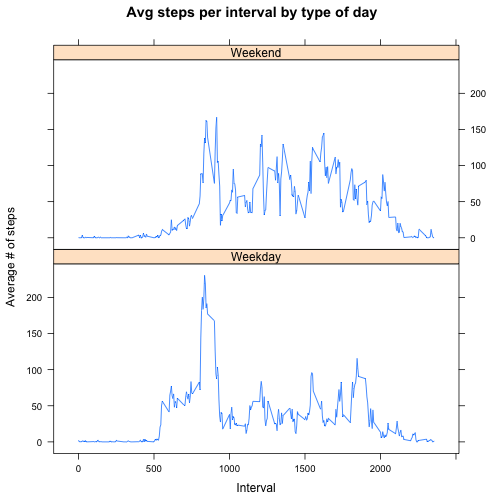

# Reproducible Research: Peer Assessment 1


## Background

It is now possible to collect a large amount of data about personal movement using activity monitoring devices such as a Fitbit, Nike Fuelband, or Jawbone Up. These type of devices are part of the “quantified self” movement – a group of enthusiasts who take measurements about themselves regularly to improve their health, to find patterns in their behavior, or because they are tech geeks. But these data remain under-utilized both because the raw data are hard to obtain and there is a lack of statistical methods and software for processing and interpreting the data.

This assignment makes use of data from a personal activity monitoring device. This device collects data at 5 minute intervals through out the day. The data consists of two months of data from an anonymous individual collected during the months of October and November, 2012 and include the number of steps taken in 5 minute intervals each day.


## Loading and preprocessing the data

After forking the data and cloning it locally, we load the file into R and specify the classes of the columns accordingly.


```r
# read data into R and inspect summary characteristics of data
StepData <- read.csv("activity.csv", header = TRUE, colClasses = c("numeric", 
    "Date", "numeric"))
summary(StepData)
```


## What is mean total number of steps taken per day?

We calculate the mean/median steps per day by aggregating all the individual intervals into days to obtain the full steps per day. This will enable the calculation of the mean and median total number of steps per day.


```r
options(scipen = 1, digits = 0)
TotalStepsPerDay <- aggregate(. ~ date, data = StepData, FUN = sum)
hist(TotalStepsPerDay$steps, xlab = "Average steps per day", main = "Histogram of Total Steps per Day")
```

 

```r
meanStepsPerDay <- mean(TotalStepsPerDay$steps)
medianStepsPerDay <- median(TotalStepsPerDay$steps)
```


The mean total steps per day is 10766.
The median total steps per day is 10765. 


## What is the average daily activity pattern?

The first step is to aggregate the raw data by interval; taking the mean for each interval across all days.


```r
TotalIntervalSteps <- aggregate(. ~ interval, data = StepData, FUN = mean)
head(TotalIntervalSteps)
library(ggplot2)
ggplot(TotalIntervalSteps, aes(interval, steps)) + geom_line()
```

 

```r
TotalIntervalSteps[which.max(TotalIntervalSteps$steps), ]
MaxInterval <- TotalIntervalSteps[which.max(TotalIntervalSteps$steps), 1]
```

The interval with the maximum number of steps on average across all days is 835.

## Imputing missing values


```r
# 3 different ways to identify the number of missing values
summary(StepData)
sapply(StepData, function(x) length(which(is.na(x))))
colSums(is.na(StepData))
noMissingValues <- colSums(is.na(StepData))[1]
```


The number of missing values in the dataset is 2304.

To eliminate the effect of missing values, we will use the average number of steps per interval to replace the missing values. We use the na.aggregate function to impute missing values using the interval time dimension.

We do not attempt to impute values using the date function because there are days with zero steps recorded such as on the 2012-10-01.


To eliminate the effect of missing values, we will use the average number of steps per interval to replace the missing values. We use the na.aggregate function to impute missing values using the interval time dimension.


```r
suppressMessages(library(zoo))
# duplicate StepData to generate an imputed StepData dataset with Intervals
ImpStepData <- StepData
ImpStepData$steps <- na.aggregate(ImpStepData$steps, by = ImpStepData$interval, 
    FUN = mean)

# Check number of missing values
noMissingValuesAfterImpute <- colSums(is.na(ImpStepData))[1]
```


There are now 0 missing values (NAs) after imputation by interval.

Now we examine what the new number of steps each day is with the new imputed dataset.


```r
ImputedTotalStepsPerDay <- aggregate(. ~ date, data = ImpStepData, FUN = sum)
par(mfrow = c(1, 2))
hist(TotalStepsPerDay$steps, xlab = "Total steps per day - pre-Imputation", 
    main = "Sum of Steps - pre Imputation")
hist(ImputedTotalStepsPerDay$steps, xlab = "Total steps per day - Imputation", 
    main = "Sum of Steps - post Imputation")
```

 

```r

meanImpStepsPerDay <- mean(ImputedTotalStepsPerDay$steps)
medianImpStepsPerDay <- median(ImputedTotalStepsPerDay$steps)
```


The new mean steps per day with the imputed data is 10766 which is unchanged from pre-Imputation.
The new median steps per day with the imputed data is 10766 which is 1 more than pre-Imputation.

The reason for the lack of change to mean or median is due to the fact that imputation was applied uniformly and as a result did not affect the distribution of the number of steps taken per day. Additionally, the distribution of the NAs was similar and as a result did not materially impact the distribution as seen by the unchanged nature of the median and mean.

## Are there differences in activity patterns between weekdays and weekends?

To examine the differences between weekdays versus weekends, we first create a new variable to insert into a new column into the table. This variable is a factor variable specifying whether the date in the row is a weekday or weekend.


```r
# convert into new variable weekdays equivalent
DayType <- weekdays(ImpStepData$date)

# Assign weekend to weekend days
DayType[DayType == "Sunday" | DayType == "Saturday"] <- "Weekend"
DayType[DayType != "Weekend"] <- "Weekday"
ImpStepData$dayType <- DayType
ImpStepData$dayType <- factor(ImpStepData$dayType, levels = c("Weekday", "Weekend"))

# validate success transformation
str(ImpStepData)

# aggregate data to interval and type of day (weekday/weekend) to calculate
# the average number of steps
stepsByDayType <- aggregate(ImpStepData$steps ~ ImpStepData$interval + ImpStepData$day, 
    ImpStepData, mean)
colnames(stepsByDayType) <- c("Interval", "dayType", "AvgNoOfSteps")
```


```r
# chart results
library(lattice)
xyplot(AvgNoOfSteps ~ Interval | dayType, stepsByDayType, type = "l", layout = c(1, 
    2), main = "Avg steps per interval by type of day", ylab = "Average # of steps", 
    xlab = "Interval")
```

 


From the two charts it appears that more steps are completed over the weekend although the distributions look rather similar. The only exception of this is around hte 6:00 to 10:00 am period of weekday where the spike is higher than weekends. Other than that, the rest of the day the number of steps is much less on weekdays than weekends.

A potential explanation for this is that on weekdays, the subject woke up earlier and walked to work, hence the higher number of steps for that period of time. 
